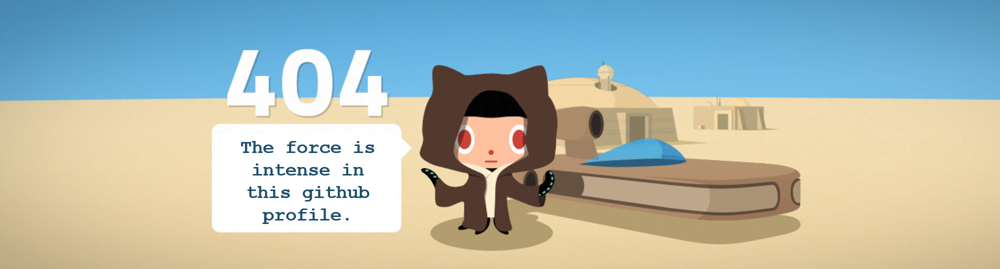

<code></code>

<h2 align="center"> Welcome to my github profile!  </h2>

 

<h3 align="center">Hi, I'm Mariano Villafuerte from Argentina, I'm a Full Stack developer.</h3>

<h2 align="center"> My Skills  </h2>

HTML, CSS, JAVASCRIPT, GIT, NODE JS, EXPRESS, REACT, REDUX, SEQUELIZE, POSTGRESQL, MONGODB, and TYPESCRIPT.

  
  
  
  
  
  
  
  
  
  
  
  

<h2 align="center"> Some of my projects  </h2>
Hey Bulldog! (Dog Breeds Catalog Page)
Full Stack Project
Created with Html-Css-Jvascript-React-Redux in Front-end and Express-Sequelize-PostgreSQL in Back-end

You can view this repo (https://github.com/nitovill/PI-Dogs-FT13)

---

How to reach me:

<a href="https://www.linkedin.com/in/nelson-mariano-villafuerte" > &nbsp;
<a href="mailto:nitovillafuerte@outlook.com" >

<!--
**nitovill/nitovill** is a ✨ _special_ ✨ repository because its `README.md` (this file) appears on your GitHub profile.

Here are some ideas to get you started:

- 🔭 I’m currently working on ...
- 🌱 I’m currently learning ...
- 👯 I’m looking to collaborate on ...
- 🤔 I’m looking for help with ...
- 💬 Ask me about ...
- 📫 How to reach me: ...
- 😄 Pronouns: ...
- ⚡ Fun fact: ...
  -->
